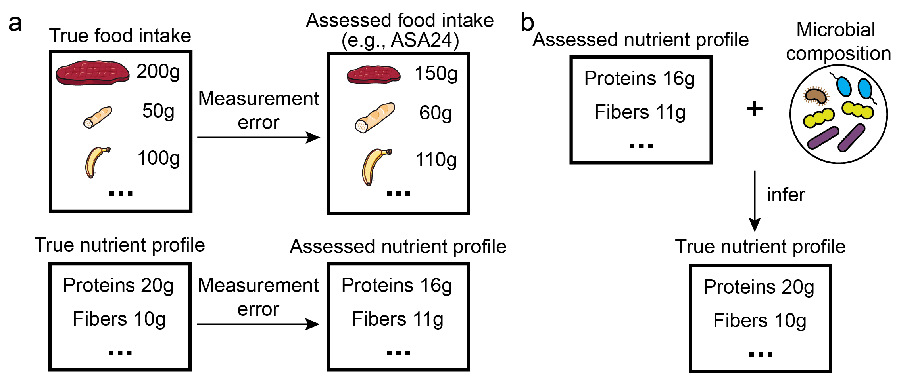
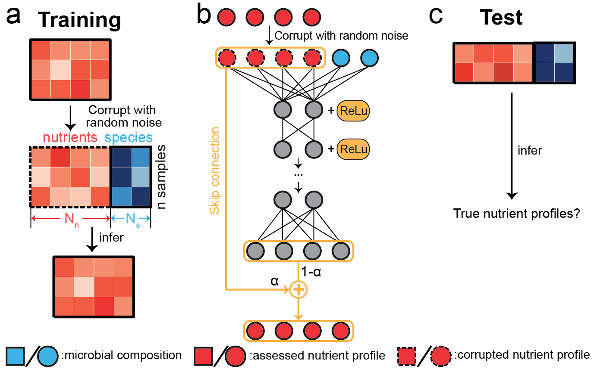

# METRIC (Microbiome-based nutrient profile corrector)
This repository contains scripts needed to run `METRIC` which leverages gut microbial composition to correct the random measurement errors in the nutrient profile derived from self-reported dietary assessment tools. A preprint entitled "Microbiome-based correction of nutrient profiles derived from self-reported dietary assessments" that describes the method in detail can be found [here](). 



## Versions
The version of Python we used is 3.7.3.

## Dependencies
Necessary Python packages can be found in `requirements.txt`. Installing those packages can be achieved by pip:
```
pip install -r requirements.txt
```

## Workflow
1. **Data processing**: `data_processing.ipynb` applies the CLR (Centred Log-Ratio) transformation to both the relative abundances of gut microbial species and nutrient profiles. The processed data of MCTs is saved in the folder `./data/MCTs`.
2. **METRIC**: the Python script `METRIC.py` loads the processed data in `./data/MCTs`. It starts the training of METRIC on the training data and then makes the final corrections on the assessed nutrient profiles from the test data. The true, assessed, and corrected nutrient profiles are saved as `performance.pickle` in the newly created folder `/METRIC_selectSkipConnection`. This new folder is within each running case under the folder `./data/MCTs`.

## Example
We showed an example of training METRIC on the MCTs dataset. The command for training and the following prediction is:
```
<PATH_TO_PYTHON> ./METRIC.py ID_OF_SPLITS PATH_TO_PROCESSED_DATA
```
<PATH_TO_PYTHON> is the path to the executable Python file located under the installed folder, ID_OF_SPLITS is the ID of the train-test split, and PATH_TO_PROCESSED_DATA is the path to the processed data that we want to load to METRIC. For MCTs dataset that we demonstrate here, the command for running the first train-test split (ID = 1) is
```
python ./METRIC.py 1 "./data/MCTs/noise_level_1.0/microbiome_nutrient_split1/METRIC_selectSkipConnection/processed_data/"
```
It is also possible to train METRIC in Jupyter notebooks. One example is provided as `METRIC_runner.ipynb`. Each correction takes less than 15 minutes to finish. The entire running process (5 cases * 5 splits) takes about 6 hours for the setting we used (Macbook Air M1 2020, 8GB RAM, 512GB SSD).

## Other datasets
The datasets utilized herein were generated by following studies: (1) MiCrobiome dieT Study (MCTS: [Johnson, A. J. et al. Cell Host & Microbe 2019](https://doi.org/10.1016/j.chom.2019.05.005)), (2) Men’s Lifestyle Validation Study (MLVS: [Mehta, R. S. et al. Nat Microbiol 2018](https://doi.org/10.1038/s41564-017-0096-0); [Li, J. et al. Gut 2022](https://doi.org/10.1136/gutjnl-2020-322473)), and (3) Westlake N-of-1 Trials for Macronutrient Intake (WE-MACNUTR: [Ma, Y. et al. The Journal of Nutrition 2021](https://doi.org/10.1093/jn/nxab227)). 

The processed sequencing data and dietary intakes relating to the MCTS are available for download in the supplemental material of the original publication ([Johnson, A. J. et al. Cell Host & Microbe 2019](https://doi.org/10.1016/j.chom.2019.05.005)). Sequence data of MLVS have been deposited in the Sequence Read Archive under BioProject ID: PRJNA354235. Other data of MLVS, including metadata can be obtained through written application, which the procedure documented in the "Data availability" section in [Mehta, R. S. et al. Nat Microbiol 2018](https://doi.org/10.1038/s41564-017-0096-0). The data associated with WE-MACNUTR can be shared by contacting Dr. Ju-Sheng Zheng (zhengjusheng@westlake.edu.cn) and proposals are required to be attached for approval.

* [Johnson, A. J. et al. Daily Sampling Reveals Personalized Diet-Microbiome Associations in Humans. Cell Host & Microbe 25, 789-802.e5 (2019).](https://doi.org/10.1016/j.chom.2019.05.005)
* [Mehta, R. S. et al. Stability of the human faecal microbiome in a cohort of adult men. Nat Microbiol 3, 347–355 (2018).](https://doi.org/10.1038/s41564-017-0096-0)
* [Li, J. et al. Interplay between diet and gut microbiome, and circulating concentrations of trimethylamine N-oxide: findings from a longitudinal cohort of US men. Gut 71, 724–733 (2022).](https://doi.org/10.1136/gutjnl-2020-322473)
* [Ma, Y. et al. Individual Postprandial Glycemic Responses to Diet in n-of-1 Trials: Westlake N-of-1 Trials for Macronutrient Intake (WE-MACNUTR). The Journal of Nutrition 151, 3158–3167 (2021).](https://doi.org/10.1093/jn/nxab227)

## License

This project is covered under the **MIT License**.